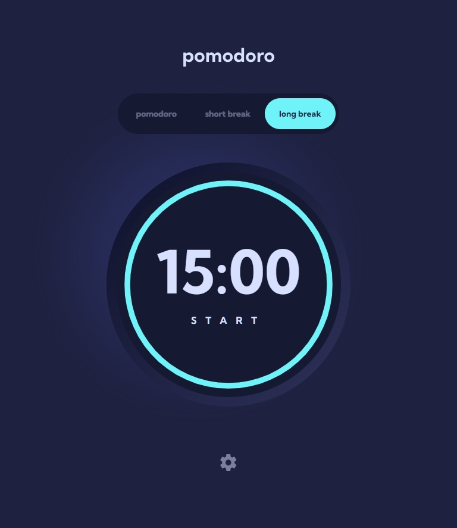

# Pomodoro App

This is a Pomodoro app that allows users to manage their time efficiently by using customizable timers for focused work sessions and breaks.

## Table of contents

- [Overview](#overview)
  - [Features](#features)
  - [Screenshot](#screenshot)
  - [Links](#links)
- [My process](#my-process)
  - [Built with](#built-with)
- [Author](#author)

## Overview

### Features

Users can:

- Set a pomodoro timer and short & long break timers
- Customize how long each timer runs for
- See a circular progress bar that updates every second and represents how far through their timer they are
- Customize the appearance of the app with the ability to set preferences for colors and fonts

### Screenshot

Desktop preview:

Tablet preview:

Mobile preview:

### Links

- Live Site URL: [Live Site](https://pomodoro-timer-responsive.netlify.app)

## My process

### Built with

- Semantic HTML5 markup
- CSS custom properties
- Flexbox
- Mobile-first workflow
- [React](https://reactjs.org/) - JS library

## Author

- Website - [Deeperr0](https://www.github.com/Deeperr0)
- Frontend Mentor - [@Deeperr0](https://www.frontendmentor.io/profile/Deeperr0)
- Twitter - [@deeperr00](https://www.twitter.com/deeperr00)
